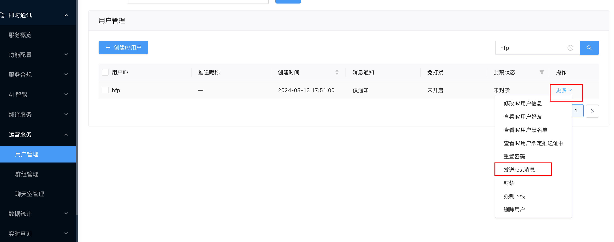

# uniApp 即时通讯 UIKit 集成示例

基于 UniApp Vue3 的即时通讯解决方案，集成 [ChatUIKit](https://github.com/easemob/easemob-uikit-uniapp) 实现聊天功能。

## 功能特性

✅ 单聊/群聊  
✅ 消息收发（文本/图片/文件）  
✅ 消息状态显示  
✅ 未读消息计数  
✅ 历史消息查询

## 快速开始

### 1. 创建空白项目

> 在 hbuilderx 中创建空白项目，选择 vue3 模板，勾选 uni-app 的 vue3 支持

### 2. 下载`easemob-uikit-uniapp`项目源码

> [项目源码地址](https://github.com/easemob/easemob-uikit-uniapp)

```bash
git clone git@github.com:easemob/easemob-uikit-uniapp.git
# or
git clone https://github.com/easemob/easemob-uikit-uniapp.git
# or
download zip
```

### 3. 复制 UIKit 核心代码

> 复制`easemob-uikit-uniapp`项目源码中的`ChatUIKit`目录下的所有文件到你的项目中，推荐与诸如`pages`、`static`、`main.js`等文件平级。

### 4. 安装依赖

第一步：在你当前的项目目录下执行以下命令：

```bash
npm init -y
```

第二步：安装依赖：

```bash
npm i easemob-websdk@latest pinyin-pro@3.26.0 mobx@6.13.4 --save
```

### 5. 运行项目

在 hbuilderx 中运行项目，即可看到效果（这一步是为了确认当前的操作是否对原有项目有其他影响或者报错）。

### 6. 初始化 UIKIT

第一步在`App.vue`中的 script 中写下如下代码：

- ChatUIKit UIKit 核心源码。
- websdk 环信核心 im 库。
- EasemobChatStatic 环信核心 im 库的类型定义。（非必须，TS 环境下使用所需）

```js
import { ChatUIKit } from "./ChatUIKit";
import websdk from "easemob-websdk/uniApp/Easemob-chat";
import { EasemobChatStatic } from "easemob-websdk/Easemob-chat";
```

第二步：在`App.vue`中的 import 引入下，写下如下代码：

```js
import { ChatUIKit } from './ChatUIKit';
import websdk from 'easemob-websdk/uniApp/Easemob-chat';
import { EasemobChatStatic } from 'easemob-websdk/Easemob-chat';

// 创建 IM 实例
const chat = new (websdk as unknown as EasemobChatStatic).connection({
  appKey: '', // 应用的 App Key
  isHttpDNS: false,
  url: '', // 环信 websocket URL
  apiUrl: '', // 环信 Restful API URL
  delivery: true // 是否开启消息已送达回执
});
// 初始化 UIKit
ChatUIKit.init({
  chat, // 传入 IM 实例
  config: {
    theme: {
			// 头像形状：圆形（circle）和方形（square）
      avatarShape: "square"
    },
    isDebug: true // 是否开启调试模式
  }
});

uni.$UIKit = ChatUIKit;
```

有可能你会出现类似错误：


解决方法：

1. 在 App.vue script 标签 上增加 `lang="ts"`
2. 在目录下增加`types`文件并参考此示例中代码追加类型定义`uni-app.d.ts`。

当然你也可以直接不用 ts，直接使用 js 的形式，那么你的初始化代码应该是这样的：

```js
import { ChatUIKit } from "./ChatUIKit";
import websdk from "easemob-websdk/uniApp/Easemob-chat";
// 创建 IM 实例
const chat = new websdk.connection({
  appKey: "", // 应用的 App Key
  isHttpDNS: false,
  url: "", // 环信 websocket URL
  apiUrl: "", // 环信 Restful API URL
  delivery: true, // 是否开启消息已送达回执
});
```

第三步：在`App.vue`中的 `style` 中写下通用样式：
这一步的目的是为了后续使用 UIKit 组件时，确保样式正常。

```css
<style>
/*每个页面公共css */
/* 通用样式 */
html,
body,
page {
  height: 100%;
  width: 100%;
}
</style>
```

### 7. 填写初始化 chat 实例的必要参数

> 该参数的来源为你创建的环信应用中所拿到的参数，具体可参考此文档。

- [参考文档](https://doc.easemob.com/document/applet/wechat.html#%E9%85%8D%E7%BD%AE%E6%9C%8D%E5%8A%A1%E5%99%A8%E5%9F%9F%E5%90%8D)
- 配置后的示例代码如下：

```js
// 创建 IM 实例
const chat = new (websdk as unknown as EasemobChatStatic).connection({
  appKey: 'easemob-demo#support', // 应用的 App Key
  isHttpDNS: false,
  url: 'wss://im-api-wechat.easemob.com/websocket', // 环信 websocket URL
  apiUrl: 'https://a1.easemob.com', // 环信 Restful API URL
  delivery: true, // 是否开启消息已送达回执
});
```

其中 `appKey` 为你创建的环信应用的 appkey。
`url` 为你创建的环信应用的 websocket 地址。
`apiUrl` 为你创建的环信应用的 restful api 地址。这几个参数都是必须的。

### 8.登录建立连接

1. 在`pages/index/index.vue`编写登录代码。

```js
// 登录
const login = () => {
  uni.$UIKit.chatStore
    .login({
      user: "", // 用户 ID
      accessToken: "", // 用户 Token
    })
    .then(() => {
      // 登录成功后，跳转会话列表页面
      uni.navigateTo({
        url: "/ChatUIKit/modules/Conversation/index",
      });
    });
};
```

其中 `uni.$UIKit.chatStore
    .login`中的`user`是你`appKey`下实际创建的用户的 ID，而`accessToken`是你在环信后台获取的用户的 Token。（实际生产环境的最佳实践则是服务端生成后返回给前端）


2. 填写登录参数后，等待编译项目，点击登录按钮。

   > 你会得到如图的类似输出：
   > 

3. 登录成功后，跳转会话列表页面。
   > 按照预期，你在调用登录成功后应该会跳转到会话列表页面，但实际并未跳转，并不是因为没有写会话列表界面，而是我们并未配置相关路由。接下来我们将进行路由配置。

### 9. 配置路由

在`pages.json`中配置路由：

> 配置效果如下：

```json
{
  "pages": [
    //pages数组中第一项表示应用启动页，参考：https://uniapp.dcloud.io/collocation/pages
    {
      "path": "pages/index/index",
      "style": {
        "navigationBarTitleText": "uni-app"
      }
    },
    {
      "path": "ChatUIKit/modules/Conversation/index",
      "style": {
        "navigationStyle": "custom",
        "app-plus": {
          "bounce": "none"
        }
      }
    }
  ],
  "globalStyle": {
    "navigationBarTextStyle": "black",
    "navigationBarTitleText": "uni-app",
    "navigationBarBackgroundColor": "#F8F8F8",
    "backgroundColor": "#F8F8F8"
  },
  "uniIdRouter": {}
}
```

按照预期你在配置上述路由后，应该可以跳转到会话列表页面了。但是你会发现并未按照预期，且页面输出如下错误：

解决方法：
重新执行运行项目,再执行登录即可。

### 10. 跳转至会话列表

执行上述步骤后，即可跳转到会话列表页面。界面如图：


### 11. 点击会话进入聊天页面

你需要如上述中的配置会话列表路由一样，增加配置聊天页面路由。

```json
{
  "pages": [
    //之前的保持不变，下述为新增配置。
    {
      "path": "ChatUIKit/modules/Chat/index",
      "style": {
        "navigationStyle": "custom",
        // #ifdef MP-WEIXIN
        "disableScroll": true,
        // #endif
        "app-plus": {
          "bounce": "none",
          "softinputNavBar": "none"
        }
      }
    }
  ]
}
```

配置后执行重新运行项目，即可跳转到聊天页面。

### 12. 进入聊天页面发送首条消息

点击会话列表中的会话，即可进入聊天页面。界面如图：

点击输入框即可发送消息。

> 该示例中会话页面的好友是本身已经发起过会话所产生的，如你新建项目没有好友，可手动至控制台操作给该好友发个消息。刷新页面即可产生一个 admin 的会话。
> 

## 常见问题

### 1. 为什么我在登录成功后，跳转会话列表页面，却没有跳转成功？

> 这是因为你没有配置路由，你需要在`pages.json`中配置路由。

### 2.登录成功后未能获取对应的会话列表？

1. 会话列表未开启，默认新建 appKey 后，会话列表是不开启的。

- 开启方法：
  - 登录环信控制台，进入应用管理，找到你创建的应用，点击进入。
  - 进入应用后，点击左侧菜单栏中的`即时通讯/功能配置/功能配置总览`，进入`功能名称`搜索框中搜索“会话”，点击查询。
  - 你会看到`服务端会话列表`点击操作即可进行功能开通。

2. 你没有给该用户发送过消息，所以会话列表中没有该用户的会话。

- 建立会话方法：
  - 你可以在控制台中，给该用户发送一条消息，即可建立会话。
  - 你也可以新打开一个 Tab 页面或应用，登录另一个用户给该用户发送一条消息。

### 3. 会话或联系人列表，未显示昵称头像,应该如何展示昵称头像？

> 在该 UIKIT 中，默认在登录的时候会通过获取联系人列表批量获取用户属性，从而拿到用户的昵称和头像。因此会话或者联系人页面的昵称头像展示有个前提条件，就是你需要在前端或者服务端注册用户时，有设置该账号的用户属性，否则会展示默认的 userId 和默认占位头像。由此衍生出如下问题：

#### 如何设置用户属性？

> - 在前端设置用户属性：

```js
const client = uni.$UIKit.getChatConn();
const option = {
  nickname: "测试头像设置",
  avatarurl: "https://avatarurl/....",
};
client.updateUserInfo(option).then((res) => {
  console.log(res);
  //更新UIKit中的用户信息
  uni.$UIKit.appUserStore.setUserInfo("userId", {
    ...option,
  });
});
```

> - 在服务端设置用户属性：
>   - 参考文档：[设置用户属性](https://doc.easemob.com/document/server-side/userprofile.html#%E8%AE%BE%E7%BD%AE%E7%94%A8%E6%88%B7%E5%B1%9E%E6%80%A7)

#### 如何不依赖用户属性自己定义展示昵称头像？

> 如果你不想依赖 UIKit 内置的调用用户属性接口从而展示昵称头像，那么你可以通过在实例化 UIkit 后，调用如下代码进行自定义：

```js
// 隐藏用户信息展示
uni.$UIKit.hideFeature(["useUserInfo"]);
// 设置自定义用户属性
uni.$UIKit.appUserStore.setUserInfo("userId", {
  nickname: "张三",
  avatarurl: "user avatar url",
});
```

#### 如果遇到群组相关如何设置群头像？

> 群头像的设置和用户头像的设置类似，只需要在群聊会话中，调用如下代码即可：

```js
// 设置群聊会话的群头像
uni.$UIKit.appUserStore.setGroupAvatar("groupId", "group avatar url");
```

详细的实现代码可参考 UIKIT 中的 demo 示例代码：
[参考地址](https://github.com/easemob/easemob-uikit-uniapp/blob/main/demo/App.vue#L45)
